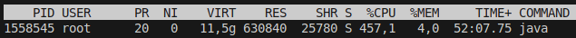
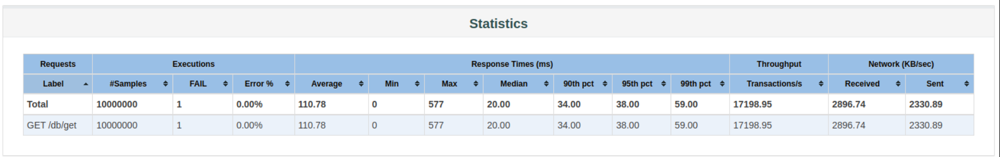
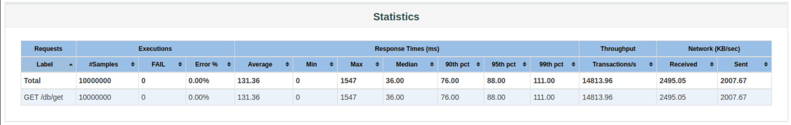
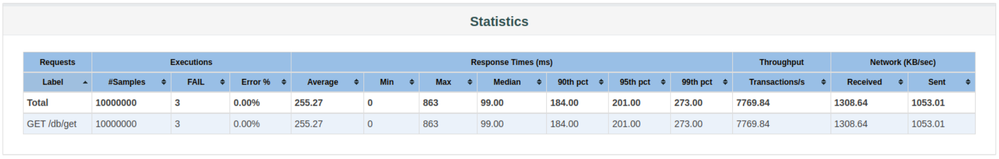

## Основные отличия от кода второго дз:

- Я убрала MapController за ненадобностью, убрала map.jmx конфиг для jmeter и преднаселение мапы данными в test.sh, убрала также и test.sh за ненадобностью

- Я добавила Configuration для шардов в файле ShardConfig.java - он запускается и складывает JdbcTemplate-ы в мапу в количестве APP_SHARD_COUNT (переменная среды) штук.

- DBController теперь принимает shardTemplates, который генерирует этот конфиг и, вычисляя shardId по хэшу ключа, использует тот JdbcTemplate, который лежит в shardTemplates по этому shardId.

- ApplicationStarter теперь преднаселяет данные на выбранных APP_SHARD_COUNT шардах самостоятельно (используя для этого постгресовый CopyManager) при запуске. Так мы можем преднаселять базы миллионами значений, когда curl-ами по апи сервера могли только на сотни. Населить базы большим количеством вхождений важно, т.к. иначе мы рискуем не увидеть эффекта из-за сравнительно слабого ускорения поиска.

## Замеры

При замерах я опять-таки звала top периодически, чтобы замерить утилизацию, она была на высоком уровне:



Инстансы Postgres-а я запускала единым docker-compose.yaml, все 8 штук сразу (Configuration уже выбирал на основе переменных среды какие из них преднаселять при старте и использовать в дальнейшем), поэтому инструкция по запуску такая, билдим образ и запускаем ансамбль контейнеров:

```
docker build -t antipova-simpleservice . && docker-compose up -d
```

После, заходим в логи контейнера app, чтобы посмотреть, как протекает процесс преднаселения шардов данными:

```
docker-compose logs -f app
```

Как только шарды заполнились данными (с обновленным предзаполнением занимает 10-20 секунд), вызываем jmeter:

```
jmeter -n -t db.jmx -l db_results.jtl && jmeter -g db_results.jtl -o report_folder
```

Смотрим index.html, который формируется в папке `load_testing/report_results`:


Посмольку переборных значений немного (`N = 1, 2, 4, 8`), я увеличила время НТ, подняв количество запросов, отсылаемых одним трэдом. Кроме того, поскольку переборных значений всего 4, я приведу тут только скрины из отчетов без построения графиков для дальнейшего анализа (точки всего 4, мало смысла строить сравнительные графики):







Как можно видеть из отчетов, 