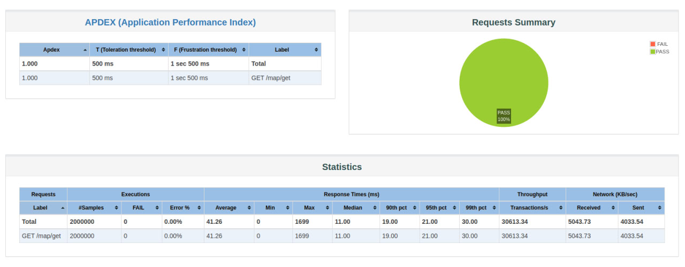
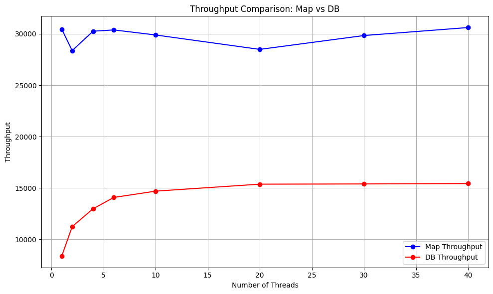

Сначала запускаем сервер в контейнере, предварительно заполнив мапу и базу (дополнительно сделала фикс в MapController с использованием thread-safe мапы вместо обычной, а также добавила юнит-тесты для db-решения):

```
docker build -t antipova-simpleservice .
docker run --rm -p 8080:8080 antipova-simpleservice
```

Далее переходим в load_testing и запускаем нагрузочные тесты. Например, выполнив из корня:

```
cd load_testing && jmeter -n -t db.jmx -l db_results.jtl && jmeter -g db_results.jtl -o report_folder
```

, можно обнаружить в созданной командой выше папке report_folder файл index.html с примерно таким отчетом от jmeter:



Размер теста был найден эмпирически (чтобы тесты крутились не слишком долго, но запускали все потоки и throughput не изменялся при увеличении размера теста). Не совсем поняла как собирать утилизацию jmeter-ом плагином PerfMon, или любым другим, поэтому просто звала top, и смотрела что утилизация достаточно высока.

На количество запущенных потоков влияют параметры "server.tomcat.max-threads" и "server.tomcat.min-spare-threads" в application.properties, а за размер пула соединений для доступа к базе - параметры "spring.datasource.hikari.maximum-pool-size" и "spring.datasource.hikari.minimum-idle". Было решено перебирать параметры запуска сервера по правилу "server.tomcat.max-threads"="spring.datasource.hikari.maximum-pool-size", "spring.datasource.hikari.minimum-idle"="server.tomcat.min-spare-threads", а "server.tomcat.min-spare-threads" = "server.tomcat.max-threads" $\cdot$ 0.5 . В итоге был получен такой сравнительный график:



Видно, что пропускная способность почти не меняется в случае с MapController-ом, а ситуация с DBController противоположная. Я себе такой результат объяснить не смогла, думала что система с базой данных будет медленнее деградировать в отличие от in-memory системы, хотя in-memory система и будет быстрее, ведь не надо устанавливать соединения. Буду благодарна за комментарии.